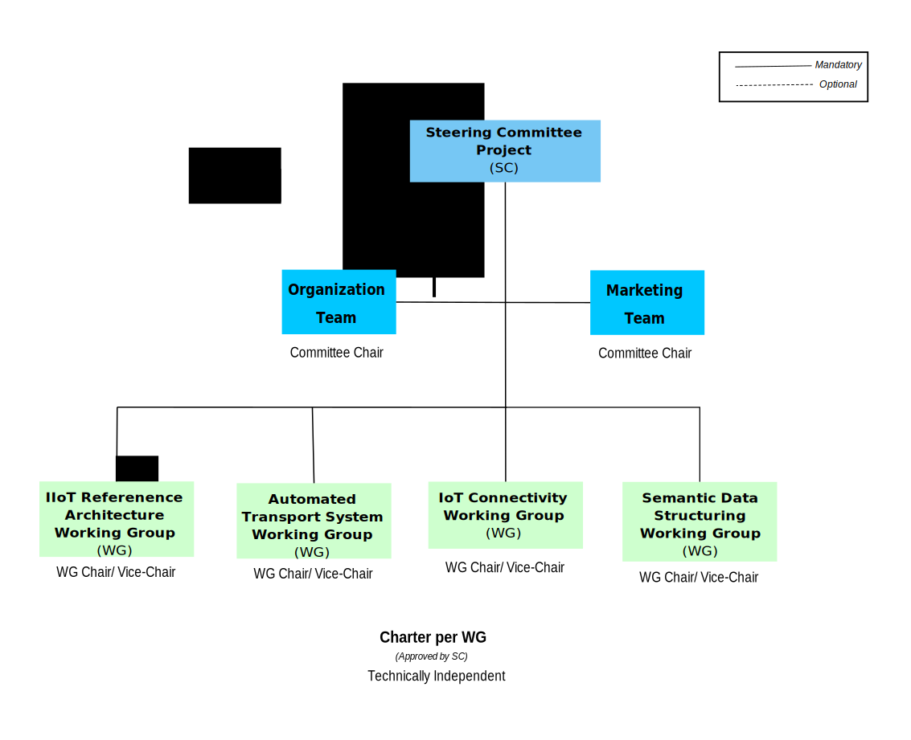

# Rules of Engagement
## OMP Tools - Processes - People
<figure>
	
	<figcaption>OMP Overview</figcaption>
</figure>

<table>
  <caption>OMP Overivew</caption>
  <thead>
    <tr>
	    <th>Category</th>
      <th>System</th>
	    <th>Description</th>
    </tr>
  </thead>
  <tbody>
   <tr>
	    <td rowspan="4"><i>Public</i></td>
      <td><a href="https://" target="_blank"><strong>Website</strong></a></td>
      <td>Public website dedicated to marketing content ...</td>
   </tr>
   <tr>
      <td><a href="https://" target="_blank"><strong>Technical Publication</strong></a></td>
      <td>Technical Specifications created by Open Manufacturig Platform ...</td>
   </tr>
   <tr>
      <td><a href="https://" target="_blank"><strong>Company Enrolment</strong></a></td>
      <td>Process steps to join OMP ...</td>
   </tr>
   <tr>
      <td><a href="https://" target="_blank"><strong>Company Onboarding</strong></a></td>
      <td>Welcome to OMP! ...</td>
   </tr>

   <tr>
	    <td rowspan="5"><i>Private - MS Teams</i></td>
      <td><a href="https://" target="_blank"><strong>Messaging</strong></a></td>
      <td> ...</td>
   </tr>
   <tr>
      <td><a href="https://" target="_blank"><strong>Meetings</strong></a></td>
      <td> ...</td>
   </tr>
   <tr>
      <td><a href="https://" target="_blank"><strong>Calendar</strong></a></td>
      <td> ...</td>
   </tr>
   <tr>
      <td><a href="https://" target="_blank"><strong>Non-Technical Docs</strong></a></td>
      <td> ...</td>
   </tr>
   <tr>
      <td><a href="https://" target="_blank"><strong>Onboarding Members in MS Teams</strong></a></td>
      <td> Welcome to OMP MS Teams! ...</td>
   </tr>
   <tr>
	    <td rowspan="3"><i>Private - GitHub</i></td>
      <td><a href="https://" target="_blank"><strong>Rules of Engagement</strong></a></td>
      <td> ...</td>
   </tr>
   <tr>
      <td><a href="https://" target="_blank"><strong>Tech Doc Devlopment</strong></a></td>
      <td> ...</td>
   </tr>
   <tr>
      <td><a href="https://" target="_blank"><strong>Onboarding Members in GitHub</strong></a></td>
      <td> Welcome to OMP GitHub Account!...</td>
   </tr>
  </tbody>
</table>

## Governance
### Organization Structure
<figure>
	
	<figcaption>OMP Governance Structure</figcaption>
</figure>

#### Technical Steering Committee
##### Committee's
##### Birds of Feather
#### Working Groups (WG)

Note:

```
Project Charter - 5. Deliverable Development Process

5.1. Working Groups. The Project may have multiple Working Groups, and each Working Group will operate as set forth in this Section and its Working Group Charter.
5.2. Working Group Chair. Each Working Group will designate a chair for that Working Group. A Working Group may select a new chair upon Approval of the Working Group Participants.
5.3. Working Group Requirements. Each Working Group must be comprised of at least 2 Working Group Participants. No Working Group Participant will be permitted to participate in a Working Group without first Joining the Working Group.

```

* Working Groups (WGs) are [chartered]() by TSC to handle one or more work items.
* WGs MAY create Working Area Groups to address specific topics within their charter.

### What to Expect from OMP Roles
* [from Members](#from-members)
* [from Editors](#from-editors)
* [from Chairs | Officers](#from-wg-chairs-officers)
* [from Maintainer(s)](#from-maintainers)
#### from Members
#### from Editors
#### from WG Chairs Officers
* In performing their tasks, officers SHALL maintain strict impartiality and act in the interest of the Organization.
* Chairs MAY limit the amount of time allocated to a particular agenda item or discussion point.
* Chairs SHALL, after a reasonable period of discussion time, use means to quickly reach a decision including (but not limited to):
  * a statement of the Chair’s view of group consensus, which shall be accepted by the group if there are no objections.
  * assignment of action items to progress the issue in a short a time period as possible.
  * invite single or few objectors to no longer sustain their objections.
  * informal voting.
  * formal voting.
* Chairs MAY require that new information be provided about an issue before earlier decisions can be reopened/revisited.
* The work and progress of the group is appropriately communicated through regular status reports to the TSC.
* The chair MAY delegate tasks to the vice-chair, including chairing the group as and when necessary.
 
 A list of the current tasks associated with the chairs responsibilities is to be found [Chair Check List]().

#### from Maintainers

##### Elections of Officers
## The Way We Work
### Meetings
* WGs are encouraged to schedule regular conference calls.
* The Meetings MUST be announced at least 7 days in advance.
* All the Organization members are contractually bound to the IPR policy under terms of the Membership Application and these IPR Guidelines must be followed.
* Meetings SHALL have an IPR call where a reminder of the IPR policy and the duties and obligations of members is provided.

### Technical Decision Making

Note:
```
Project Charter - 4. Decision Making

4.1. Consensus/Voting/Approval. The Steering Committee and each Working Group will endeavor to make all decisions by consensus. Where the Steering Committee or Working Group cannot reach consensus with respect to a particular decision, the Steering Committee or Working Group will make that decision by a Supermajority Vote of the Steering Members or Working Group Participants, as applicable.
4.2. Notifications and Electronic Voting. The Executive Director is responsible for issuing all notifications of meetings and votes of the Steering Members and each Working Group chair is responsible for issuing all notifications of meetings and votes of the Working Group for which it is the chair, in each case subject to the following minimum criteria: (i) in-person meetings require at least 30 days prior written notice, (ii) teleconference meetings require at least 7 days prior written notice (this requirement only applies to the notification of the first meeting of automatically recurring teleconference meetings), (iii) electronic votes require no advance notice but must be made pursuant to a clear and unambiguous ballot with only “yes” and “no” options, and the voting must remain open for no less than 7 days. These notification requirements with respect to the Project or that particular Working Group may be overridden upon unanimous consent of all Steering Members or all applicable Working Group Participants that have attended and participated in at least 50% of the last 4 meetings of the Project or Particular Working Group.
```

As part of their responsibilities defined in [from WG Chairs Officers](), officers need to ensure efficient and effective decision-making. 
* The decision making process in WGs is intended to be as inclusive as possible. 
* WGs shall attempt to use consensus to make decisions. 
* If consensus cannot be reached, voting mechanisms MAY be used. 
* Formal notice SHALL be given for decision making, e.g.:
  * Inclusion of a document on an agenda, proposing a specific decision to be taken (e.g. Pull Request).
  * Inclusion of an item directly in the agenda (e.g. proposed next meeting date).
  * Items proposed for approval via the group mailing list (e.g. agreement a document revision).
  * Inclusion of a document for decision in an electronic Review, Comment and Approval event
  * Inclusion of a document for decision in an e-vote event.
 > The above list is not exhaustive.
* There SHALL be no distinction in the decision-making merit of real-time or non-real-time meetings.

#### Seeking Consensus
* Groups shall endeavour to reach consensus on all decisions. 
* Informal methods of reaching consensus are encouraged (e.g. a show of hands).
* Groups SHOULD attempt to ensure contributions relating to the same subject matter are considered together before being disposed. 
* However the chair SHALL ensure that progress is not delayed by unavailable contributions or participants.
* Agreement SHALL be sought in all forms of meeting.

#### Handling objections when seeking consensus
* Objections from a small minority SHOULD be minuted and the objecting delegates SHOULD be questioned if having their objections minuted is sufficient and they agree to not sustain their objections. 
  * If such agreements are secured, then there is consensus for approving the proposal. 
  * If such agreements are not secured, then the proposal is not agreed and further action SHALL be taken (e.g. the proposal is withdrawn, updated, or voted on). 
  * Members are discouraged from sustaining their objections when it is clear that they would be overruled by a vote were one to take place.
* In real-time meetings, consensus can be determined by receiving no sustained objections to a proposal.
  * Efforts to immediately resolve or record objections can be taken to attempt to achieve consensus.
* Where attendance is sparse when viewed from normal participation levels, potentially controversial proposals SHOULD be made available to the broader membership. 
* The chair is responsible for ensuring such opportunity for participation in the decision making process. 
* Sparsely attended meetings SHOULD NOT be used to drive through proposals that would not have broad support.
* Following a decision-making meeting, a summary of decisions and document dispositions SHALL be published as soon as is practical. 
  * This will be addressed if the meeting minutes are available in a timely fashion.
* When there is insufficient time for review in a real-time meeting, non-real-time consensus approaches SHOULD be considered.  
* In non-real time meetings consensus SHOULD be developed by using "Review & Agreement" periods, e.g.:
  * Using the group mailing list
  * Using GitHub "Review and Approval" label
* Proposals SHALL be available for a given period.

#### Using voting to achieve agreement 

<table>
  <caption>Summary overview of Voting Procedures</caption>
  <thead>
    <tr>
	    <th>Type of formal vote </th>
	    <th>Threshold for approvald</th>
    </tr>	      
  </thead>	    
  <tbody>
    <tr>
	<td>TSC vote on specification material intended to be ratified by the Board</td>
	<td>At least two thirds of those Full and Sponsor Members who cast a vote</td>	    
    </tr>
    <tr>
	<td>All other formal votes</td>
	<td>Greater than fifty percent (50%) of those who cast a vote</td>
    </tr>    
  </tbody>
</table>

##### Phrasing of Voting Questions
* The chair ensures that questions to be voted upon SHALL be phrased in a concise and unambiguous manner. 
* Questions SHOULD NOT be phrased as the “The group SHALL not do xyz”. Examples of appropriate questions are:
  * SHALL the group agree the Specification?
  * SHALL the liaison be approved?
  * SHALL the new Work Item be approved?
  * SHALL the existing Work Item be stopped?
  * If the issue is to choose between two options (i.e. A or B), an example of the appropriate question may be:
  * SHALL the group agree Option A or Option B?
* The option receiving the highest number of votes SHALL be the decision of the group.
* If the issue is to choose between three or more options, the group SHOULD use informal voting to reduce the number of options to two, and then use formal voting, if necessary.

##### Voting on Technical Issues
This section provides a summary of the voting procedures defined in section [Using voting to achieve agreement]().


<table>
  <caption>Summary overview of Voting Procedures</caption>
  <thead>
    <tr>
	    <th>Procedure</th>
	    <th>For additional information see Section</th>
    </tr>	      
  </thead>	    
  <tbody>
    <tr>
	<td>Before voting, a clear definition of the issues SHALL be provided by the chair</td>
	<td>TBD</td>
    </tr>
    <tr>
  <td>Members eligible to vote, SHALL only be entitled to one vote each</td>
  <td>TBD</td>
    </tr>
    <tr>
  <td>Each member MAY cast its vote as often as it wishes, and the last vote it casts counts</td>
  <td>TBD</td>
    </tr>
    <tr>
	<td>Voting MAY be performed electronically.</td>
	<td>TBD</td>
    </tr>
    <tr>
	<td>Voting MAY be performed by show of hands and members announcing their vote verbally one by one, or paper ballots.</td>
	<td>TBD</td>
    </tr> 
    <tr>
	<td>The result of the vote SHALL be recorded in the meeting minutes</td>
	<td>TBD</td>
    </tr> 
    <tr>
	<td>Groups MAY use informal voting to reach consensus. If the Group is still unable to reach consensus, then a formal vote MAY be taken. </td>
	<td>TBD</td>
    </tr> 
    <tr>
	<td>Each member’s electronic vote SHALL be electronically acknowledged to confirm participation in the vote.</td>
	<td>TBD</td>
    </tr> 
    <tr>
	<td>The voting period for proposals voted in non-real-time SHALL be as defined in section TBD.</td>
	<td>TBD</td>
    </tr>      
  </tbody>
</table>


### Ratification of decisions and appeals

## Working with other organizations

## Work Flow
### Technical Specifications Development Phases

Note:
```
Project Charter - 7. Deliverable Development Process

7.1. Pre-Draft. Any Working Group Participant or Contributor may submit a proposed initial draft document as a candidate Draft Deliverable of that Working Group. The Working Group chair will designate each submission as a “Pre-Draft” document.
7.2. Draft. Each Pre-Draft document of a Working Group must first be Approved by the Working Group Participants of that Working Group to become a Draft Deliverable. Once the Working Group approves a document as a Draft Deliverable, the Draft Deliverable becomes the basis for all going forward work on that deliverable.
7.3. Working Group Approval. Once a Working Group believes it has achieved the objectives for its deliverable as described in the Scope, it will progress its Draft Deliverable to “Working Group Approved” status. 
7.4. Final Approval. Upon a Draft Deliverable reaching Working Group Approved status, the Executive Director or his/her designee will present that Working Group Approved Draft Deliverable to all Steering Members for Approval. Upon Approval by the Steering Members, that Draft Deliverable will be designated an “Approved Deliverable.”
7.5. Publication and Submission. Upon the designation of a Draft Deliverable as an Approved Deliverable, the Executive Director will publish the Approved Deliverable in a manner agreed upon by the Working Group Participants (i.e., Project Participant only location, publicly available location, Project maintained website, Project member website, etc.). The publication of an Approved Deliverable in a publicly accessible manner must include the terms under which the Approved Deliverable and/or source code is being made available under, as set forth in the applicable Working Group Charter.
7.6. Submissions to Standards Bodies. No Draft Deliverable or Approved Deliverable may be submitted to another standards development organization without Approval by the Steering Members. Upon Approval by the Steering Members, the Executive Director will coordinate the submission of the applicable Draft Deliverable or Approved Deliverable to another standards development organization with Joint Development Foundation Projects, LLC. Working Group Participants that developed that Draft Deliverable or Approved Deliverable agree to grant the copyright rights necessary to make those submissions.

```

In this section the diagram below depictures the development phases of technical documents.
<table>
  <caption>Technical Specifications Development Phases</caption>
  <thead>
    <tr>
	    <th>Phase</th>
	    <th>Description</th>
    </tr>
  </thead>
  <tbody>
    <tr>
	    <td><strong>Work Item</strong></td>
      <td>In this phase the group agrees the scope of the work to be developed. [Work Item template]()</br>
          Any member can provide a new Work Item proposal, the document is discussed among the group and further elaborated.
          The group will vote whether the Work Item is formally approved and endorsed by the majority of the group or rejected.</br>
          If the proposal is approved, the Work Item is moved to the next phase, <strong>Technical Development</strong>. </td>
    </tr>
    <tr>
	    <td><strong>Technical Development</strong></td>
      <td>A Technical Specification MAY be composed of one or more documents:
        <ul>
          <li><strong>Requirements Document</strong>, (RD)</li>
          <li><strong>Architecture Document</strong>, (AD</li>
          <li><strong>Technical Specification Document(s)</strong>, (TS)</li>
          <li><strong>Supporting Document(s)</strong>, (SUP)</li>
        </ul>
        <strong>Note:</strong> in some cases the group MAY agree to develop a single document that contains the above list as sections.</br>
        The first document to be developed is the <strong>Requirements Document</strong>,[RD](). It contains the business requirements (not technical requiremnts). The busisness requirements are derived from the Use Cases described in the <strong>RD</strong> document.</br>
        Once the [RD]() document is completed, it can be moved forward to the next development phases: 
        <ul>
          <li><strong>Review | Approval</strong></li>
          <li><strong>Ratification</strong></li>
          <li><strong>Publication | Maintenance</strong><li>
        </ul>
        before continuing with the development of the rest of the documents.</br>
        Once the [RD]() document is finalized, the WG has the necessary input: (business requirements) to proceed with the development of rest of the Technical Specifications.
      </td>
   </tr>
   <tr>
	    <td><strong>Review | WG Approval</strong></td>
	    <td>In this phase, the document(s) developed by the WG are formally reviewed by the group. Once the WG completes the formal <strong>Review</strong> the document(s) MUST be agreed by the WG before sending the document(s) to the Steering Committee for formal <strong>Ratification</strong>.</td>
   </tr>
   <tr>
	    <td><strong>Steering Committee Ratification</strong></td>
	    <td>Once the document(s) are <strong>Reviewed</strong> and agreed by the group, the document(s) are sent to the Steering Committee for formal <strong>Ratification</strong>.</td>
   </tr>   
   <tr>
	    <td><strong>Publication | Maintenance</strong></td>
	    <td>Upon Steering Committee <strong>Ratification</strong> the document(s) are ready for <strong>Publication</strong>.</br>
      To publish the document(s), the Maintainer will merge the "staging" branch into the "master" branch. </br>
      The publication will be done authomatically.</br>
      The last phase is the <strong>Maintenance</strong> phase. The Technical Specifications are now available to the public for downloading.</br
      >  
      This phase is of paramount importance. It is in this phase when the Specifications will be adopted by the market.</br>
      The WG needs to open a via of "dialogue" with the public via <strong>GitHub Issues</strong> and other forms of engagement. </br>
      The input collected during this <strong>Maintenance</strong> phase SHOULD be used to improve the Technical Specifications as well as to collect business requirements for future releases.
      </td>
   </tr>   
  </tbody>
</table>
<figure>
	
	<figcaption>OMP Technical Specifications Development Phases</figcaption>
</figure>

### GitHub Flow
<table>
  <caption>GitHub Work Flow</caption>
  <thead>
    <tr>
	    <th>Branch</th>
	    <th>Description</th>
    </tr>
  </thead>
  <tbody>
    <tr>
	    <td><i>Rel vX.Y.Z"</i></td>
      <td>Release-tag's contain all the different versions of the Technical Specifications that have been approved by the Working Group and ratified by the Technical Steering Committee. The name of the release tag will follow Semantic versioning principles.</td>
   </tr>
    <tr>
	    <td><i>master</i></td>
      <td>This branch contains the latest version of the Technical Specfication approved by the Working Group and ratified by the Technical Steering Committee. Its content will be moved into a release-tag, to perserve the content of the version.</td>
   </tr>
   <tr>
	    <td><i>staging</i></td>
	    <td>This branch contains a draft specification that are stable, approved by the Working Group but still under development. This branch SHALL NOT contain any feature that is not part of the delivery plan.</td>
   </tr>
   <tr>
	    <td><i>feature-branch-x</i></td>
	    <td>Feature branches are dedicated to develop specific features, concepts, sections, etc. These branches are not stable, content is developed here until it is stable and completed. At that point it can be merged into the "staging" branch. </td>
   </tr>
  </tbody>
</table>

<figure>
	
	<figcaption>OMP GitHub Flow</figcaption>
</figure>

## Reference Material
### Documents
* [Charters]()
* [Dictionary]()
* [Templates](https://github.com/OpenManufacturingPlatform/templates)
* [Publication]()

### Collaboration Tools
* [MS Teams]()
* [GitHub](https://github.com/OpenManufacturingPlatform)
### How to Guidelines
### GitHub
* [Issue Creation](https://help.github.com/en/github/managing-your-work-on-github/creating-an-issue)
* [Creation Pull Request](https://help.github.com/en/github/collaborating-with-issues-and-pull-requests/creating-a-pull-request)
* [Managing Project Boards](https://help.github.com/en/github/managing-your-work-on-github/managing-project-boards)


